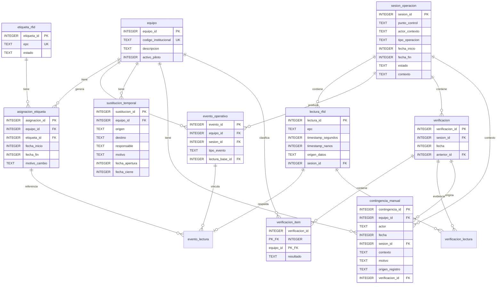

# Manual técnico-pedagógico del software del MVP

## Proyecto EMI — Trazabilidad RFID pasiva

**Versión del documento:** 1.0 — 15 de septiembre de 2026
**Basado en:** Código fuente del repositorio, 243 pruebas automatizadas, migraciones V1–V8
**Propósito:** Estudio, comprensión y defensa técnica del software
**Audiencia:** Estudiante de Bioingeniería con conocimientos básicos/intermedios de programación

---

# PARTE 1 — Visión general del software

## 1.1 El problema que resuelve

EMI Medellín administra equipos biomédicos (camillas, monitores, desfibriladores, etc.) que ingresan y salen de una sede. Actualmente el registro de estos movimientos se realiza de forma manual, lo que genera errores, demoras y falta de trazabilidad.

El Proyecto EMI propone colocar **etiquetas RFID pasivas** en cada equipo y un **lector UHF** en un punto de control, de modo que el sistema pueda:

1. Detectar automáticamente qué equipos pasan por ese punto.
2. Registrar cada movimiento (ingreso o salida) de forma inmutable.
3. Verificar si los equipos esperados realmente fueron detectados.
4. Manejar excepciones (sustituciones temporales, contingencias manuales).
5. Conservar un historial auditable de todo lo anterior.

## 1.2 El papel del software dentro del proyecto RFID

El software es **una de las piezas** del proyecto, no el proyecto completo. El proyecto tiene tres dimensiones:

```
┌─────────────────────────────────────────────────────┐
│                   PROYECTO EMI                       │
├──────────────┬──────────────────┬────────────────────┤
│  HARDWARE    │    SOFTWARE      │   VALIDACIÓN       │
│  - Lector UHF│  - Lógica        │   - Piloto         │
│  - Etiquetas │  - Base de datos │   - Prepruebas RF  │
│  - Antenas   │  - Pruebas       │   - Métricas       │
│  - Cableado  │  - Simulación    │   - Cobertura real │
└──────────────┴──────────────────┴────────────────────┘
```

El software puede funcionar con datos simulados **sin necesidad del lector físico**. Esto es intencional: permite desarrollar, probar y demostrar toda la lógica antes de tener el hardware.

## 1.3 Qué puede y qué NO puede demostrar el software

### SOFTWARE/SIMULACIÓN puede demostrar ✅

| Capacidad | Evidencia |
|-----------|-----------|
| Registrar equipos, etiquetas y asociaciones | 22 pruebas I1 |
| Producir lecturas simuladas con el contrato correcto | 19 pruebas I2 |
| Persistir lecturas crudas de forma inmutable | 17 pruebas I3 |
| Deducir eventos de movimiento sin duplicar | 36 pruebas I4 |
| Consultar historiales por equipo | 27 pruebas I5 |
| Verificar esperados vs detectados | 22 pruebas I6 |
| Gestionar sustituciones temporales | 16 pruebas I7 |
| Registrar contingencias sin crear lecturas ficticias | 17 pruebas I8 |
| Transacciones, rollback, concurrencia | Pruebas en cada incremento |
| Migración de base de datos V1→V8 sin pérdida | 8 pruebas de migración |

### RF_REAL / hardware / piloto NO puede demostrar ❌

| Aspecto | Razón |
|---------|-------|
| Alcance físico RFID | Depende de antenas, potencia, entorno |
| Tasa real de lectura | Depende del lector y las etiquetas |
| Interferencia electromagnética | Requiere medición en sitio |
| Comportamiento sobre metal | Requiere pruebas con activos reales |
| Desempeño de antenas | Requiere prepruebas RF_REAL |
| Cobertura del punto de control | Requiere piloto |

> **Regla fundamental:** SOFTWARE/SIMULACIÓN ≠ RF_REAL. Las 243 pruebas demuestran que la lógica funciona correctamente con datos controlados. No demuestran que un lector físico leerá todas las etiquetas en un entorno real.

## 1.4 Por qué el proyecto desacopla software de hardware

Imagina que el software estuviera escrito directamente para el lector Chainway U300. Si mañana se cambia el lector por un modelo diferente, habría que reescribir gran parte del código.

En lugar de eso, el proyecto define un **contrato** (una interfaz Java llamada `FuenteLecturasRFID`) que dice: "cualquier fuente de lecturas debe poder iniciar, detenerse y entregar observaciones con EPC, timestamp y origen". Así:

- **Hoy** se usa `FuenteSimulada` (genera datos de prueba).
- **Cuando P1 lo autorice**, podrá construirse un adaptador UHF compatible que implemente el mismo contrato. `AdaptadorU300` es una posibilidad provisional, condicionada a unidad, firmware, SDK, runtime y configuración.
- **El resto del software no cambia**.

```
FuenteSimulada ─────┐
                     ├──▶ FuenteLecturasRFID (contrato) ──▶ ServicioI3 ──▶ BD
AdaptadorU300  ─────┘     (misma interfaz)
(futuro)
```

---

# PARTE 2 — Historia de construcción I1-I8

El software no se construyó de golpe. Se fue agregando funcionalidad en **incrementos**, cada uno resolviendo un problema concreto y dejando preparado el terreno para el siguiente.

## I1 — Entidades y asociaciones

**Problema:** Necesitamos saber qué equipos existen, qué etiquetas RFID tenemos y cuál etiqueta está pegada a cuál equipo.

**Requisito:** RF-001 — Asociar equipo/código institucional y etiqueta RFID.

**Clases nuevas:**
- `Equipo` — identidad institucional (código, descripción, si participa en piloto)
- `EtiquetaRFID` — identificador electrónico (EPC, estado activa/inactiva)
- `AsignacionEtiqueta` — vínculo equipo↔etiqueta con fechas de inicio/fin
- `ServicioI1` — casos de uso: crear, asociar, corregir, consultar historial
- `RepositorioI1` — contrato de persistencia
- `JdbcRepositorioI1` — implementación con SQL directo

**Tablas:** `equipo`, `etiqueta_rfid`, `asignacion_etiqueta` (V2)

**Lógica clave:**
- Un equipo solo puede tener **una** etiqueta vigente a la vez.
- Una etiqueta solo puede estar asignada a **un** equipo a la vez.
- Corregir una asociación **cierra** la anterior (poniendo `fecha_fin`) y **crea** una nueva. Nunca borra.

**Pruebas:** 32 pruebas cubriendo creación, duplicados, asociación, corrección, historial, concurrencia, rollback.

**Preparó para I2:** El modelo de EPC que las lecturas RFID usarán para identificar equipos.

---

## I2 — Fuente de lecturas RFID

**Problema:** Necesitamos una forma de recibir lecturas RFID sin depender de un lector físico.

**Requisitos relacionados:** TEC-002 — interfaz común e independencia del hardware; aporta a RF-002 y DAT-002, que siguen EN DESARROLLO.

**Clases nuevas:**
- `LecturaEntradaRFID` — observación de entrada (EPC, timestamp, origen, metadata)
- `OrigenDatos` — enum con `SIMULACION` y `RF_REAL`
- `FuenteLecturasRFID` — interfaz (contrato) con `iniciar`, `detener`, `estado`
- `FuenteSimulada` — implementación determinística para pruebas

**Lógica clave:**
- La fuente entrega datos a través de un **callback** (receptor).
- No interpreta movimientos ni elimina repeticiones.
- `SIMULACION` y `RF_REAL` quedan diferenciados desde el origen.

**Pruebas:** 19 pruebas de FuenteSimulada + 1 de aislamiento.

**Preparó para I3:** Las lecturas que se persistirán en la base de datos.

---

## I3 — Persistencia de sesiones y lecturas

**Problema:** Las lecturas deben guardarse permanentemente y organizarse en sesiones operativas.

**Requisitos relacionados:** RF-002 y RF-003 — captura/contexto en desarrollo; aporta a DAT-002 y DAT-003. La separación DAT-001 se completa junto con I4.

**Clases nuevas:**
- `SesionOperacion` — contexto: punto de control, actor, tipo (INGRESO/SALIDA/VERIFICACIÓN), estado
- `LecturaRFID` — lectura persistida con ID, inmutable
- `ServicioI3` — crear sesiones, persistir lecturas, cerrar sesiones

**Tablas:** `sesion_operacion`, `lectura_rfid`, `lectura_rfid_metadata` (V3)

**Lógica clave:**
- Las lecturas son **inmutables**: una vez guardadas, no se pueden modificar ni borrar.
- Una sesión se abre, recibe lecturas, y se cierra. No se puede reabrir.
- Las lecturas repetidas del mismo EPC **se conservan todas**.

**Pruebas:** 17 pruebas cubriendo CRUD, inmutabilidad, concurrencia, rollback.

**Preparó para I4:** Las lecturas persistidas que el motor de eventos interpretará.

---

## I4 — Motor de eventos y deduplicación

**Problema:** Múltiples lecturas del mismo EPC en la misma sesión deben producir **un solo** evento operativo (ingreso o salida), no uno por cada lectura.

**Requisitos relacionados:** RF-003 — contexto y evento, todavía EN DESARROLLO; DAT-001 — separación lectura/evento, IMPLEMENTADO; VAL-003 — criterio lógico de cero duplicados verificado, con estado EN DESARROLLO.

**Clases nuevas:**
- `EventoOperativo` — interpretación: un equipo hizo un movimiento (ingreso/salida)
- `EvidenciaEvento` — vínculo auditable entre evento y lecturas fuente
- `TipoEvento` — enum: `INGRESO`, `SALIDA`
- `ResultadoProcesamiento` — resultado detallado del motor para cada lectura
- `ServicioI4` — motor que procesa lecturas y crea/vincula eventos

**Tablas:** `evento_operativo`, `evento_lectura` (V4)

**Lógica clave:**
- 20 lecturas del mismo EPC → 20 lecturas conservadas → **1** evento → 20 evidencias vinculadas.
- El tipo de evento (INGRESO/SALIDA) proviene del **tipo de sesión**, no de la antena.
- Una lectura ya procesada no se reinterpreta.
- La asociación histórica determina qué equipo corresponde a cada EPC **en el momento de la lectura**.

**Pruebas:** 36 pruebas cubriendo deduplicación, asociaciones históricas, huecos, solapamientos, rollback, concurrencia.

**Preparó para I5:** Los eventos y evidencias que se consultarán por equipo.

---

## I5 — Consultas por equipo

**Problema:** Necesitamos consultar el historial completo de un equipo: sus lecturas, eventos y evidencias.

**Requisito:** RF-004 — Consultar última lectura e historial por equipo, IMPLEMENTADO en SOFTWARE.

**Clases nuevas:**
- `ServicioI5` — consultas: última lectura, último evento, historiales, evidencias
- `LecturaAtribuida` — lectura con su asociación histórica resuelta
- `EventoConContexto` — evento con su sesión y orígenes de datos

**Índices:** `ix_lectura_epc_tiempo`, `ix_evento_equipo_tiempo` (V5)

**Lógica clave:**
- Solo consulta; no modifica datos.
- Atribuye lecturas a equipos usando la asociación vigente **en el momento de la lectura**, no la actual.
- Optimizada con índices para evitar escaneos completos.

**Pruebas:** 27 pruebas cubriendo consultas, temporalidad, inmutabilidad de resultados, rendimiento (sin N+1).

**Preparó para I6:** La capacidad de consultar lecturas y asociaciones por sesión para la verificación.

---

## I6 — Verificación (RF-005)

**Problema:** Después de que un lote de equipos pasa por el punto, necesitamos verificar: ¿se detectaron todos los que esperábamos?

**Requisito:** RF-005 — Verificar esperados vs detectados.

**Clases nuevas:**
- `Verificacion` — cabecera de un intento de verificación
- `VerificacionItem` — resultado por equipo (DETECTADO/FALTANTE/NO_ESPERADO)
- `EvidenciaVerificacion` — estado de cada lectura en la verificación
- `ResultadoVerificacion` — enum: `DETECTADO`, `FALTANTE`, `NO_ESPERADO`
- `ServicioI6` — verificar, reintentar, consultar historial

**Tablas:** `verificacion`, `verificacion_item`, `verificacion_lectura` (V6)

**Lógica clave:**
- Compara dos conjuntos: esperados vs detectados.
- Permite **reintentos** enlazados al intento anterior.
- **No genera eventos operativos** (INGRESO/SALIDA).

**Pruebas:** 22 pruebas.

**Preparó para I8:** Los ítems FALTANTE que justifican una contingencia.

---

## I7 — Sustitución temporal (RF-007)

**Problema:** Si un equipo se presta temporalmente a otra sede, hay que registrarlo sin perder el historial.

**Requisito:** RF-007 — Registrar sustituciones temporales.

**Clases nuevas:**
- `SustitucionTemporal` — record con equipo, origen, destino, responsable, motivo, fechas
- `ServicioI7` — abrir, cerrar (devolver), consultar activa, historial

**Tablas:** `sustitucion_temporal` (V7)

**Lógica clave:**
- Máximo **una** sustitución activa por equipo (garantizado por BD + lógica).
- El cierre no borra: solo asigna `fecha_cierre`.

**Pruebas:** 16 pruebas.

---

## I8 — Contingencia manual (RF-006)

**Problema:** Si un equipo no fue detectado después de reintentos, un operador debe poder declarar manualmente su presencia sin inventar una lectura RFID.

**Requisito:** RF-006 — Contingencia manual.

**Clases nuevas:**
- `ContingenciaManual` — record con equipo, actor, fecha, sesión, contexto, motivo, verificación, confirmación
- `ServicioI8` — registrar omisión, registrar fuera de ruta, confirmar, historial

**Tablas:** `contingencia_manual` (V8)

**Lógica clave:**
- Una contingencia **nunca** crea una `LecturaRFID`. El campo `origen_registro` es siempre `'MANUAL'`.
- La confirmación no genera un `EventoOperativo`.
- Los activos fuera de ruta no requieren un intento RFID previo.

**Pruebas:** 17 pruebas, incluyendo 2 que verifican explícitamente `assertEquals(0, contar("lectura_rfid"))`.

---

## Diagrama de dependencias entre incrementos

```
I1 (Entidades)
 │
 ├──▶ I2 (Fuente RFID) ──▶ I3 (Sesiones/Lecturas) ──▶ I4 (Eventos) ──▶ I5 (Consultas)
 │                                                                           │
 └───────────────────────────────────────────────────────────────────────────┐│
                                                                            ▼▼
                                                        I6 (Verificación)──▶ I8 (Contingencia)
                                                                   │
                                                        I7 (Sustitución) ◄──┘ (independiente)
```

**Dependencias reales:**
- I6 necesita I3 (sesiones, lecturas) e I1 (equipos, asociaciones).
- I7 solo necesita I1 (equipos).
- I8 necesita I6 (verificaciones con ítems FALTANTE) e I1 (equipos).
- Todos comparten la base de datos y las migraciones acumulativas.

---

# PARTE 3 — Arquitectura interna

## 3.1 ¿Qué es la arquitectura por capas?

Imagina una cebolla. Cada capa envuelve a la anterior y tiene un rol específico. Las capas internas no conocen a las externas. Las externas sí conocen a las internas.

```
┌──────────────────────────────────────────────────────────────┐
│                    ENTRADA / FUENTES                         │
│  ConsolaEmi, FuenteSimulada, (futuro: AdaptadorU300)         │
├──────────────────────────────────────────────────────────────┤
│                    INFRAESTRUCTURA                           │
│  JdbcRepositorioI1..I8, JdbcUnidadDeTrabajo, BaseDatos       │
├──────────────────────────────────────────────────────────────┤
│                    PUERTOS (interfaces)                      │
│  FuenteLecturasRFID, RepositorioI1..I8, UnidadDeTrabajo      │
├──────────────────────────────────────────────────────────────┤
│                    APLICACIÓN (servicios)                    │
│  ServicioI1, ServicioI3..I8, ValidacionMvp                   │
├──────────────────────────────────────────────────────────────┤
│                    DOMINIO (entidades)                       │
│  Equipo, EtiquetaRFID, LecturaRFID, EventoOperativo, etc.   │
└──────────────────────────────────────────────────────────────┘
```

## 3.2 Capa por capa

### DOMINIO — "¿Qué cosas existen y qué reglas internas tienen?"

**Concepto:** Son las "cosas" del mundo real representadas en código: equipos, etiquetas, lecturas, eventos. No saben nada de bases de datos, SQL ni interfaces gráficas.

**En el proyecto:** Todos los records Java en `co.emi.trazabilidad.dominio`:
- `Equipo`, `EtiquetaRFID`, `AsignacionEtiqueta`
- `LecturaEntradaRFID`, `LecturaRFID`, `OrigenDatos`
- `SesionOperacion`, `EstadoSesion`, `TipoOperacion`
- `EventoOperativo`, `EvidenciaEvento`, `TipoEvento`
- `Verificacion`, `VerificacionItem`, `EvidenciaVerificacion`, `ResultadoVerificacion`
- `SustitucionTemporal`, `ContingenciaManual`

**Qué puede conocer:** Solo a sí misma (otros records del dominio, enums del dominio).
**Qué NO conoce:** SQL, SQLite, JDBC, servicios, repositorios, interfaz de usuario.

**Ejemplo real:** `AsignacionEtiqueta` valida en su constructor que `fechaFin` no sea anterior a `fechaInicio`. No necesita la base de datos para saber eso.

### APLICACIÓN — "¿Qué operaciones puede hacer el sistema?"

**Concepto:** Los "servicios" que orquestan las reglas de negocio. Reciben datos, validan, coordinan operaciones y devuelven resultados. No saben cómo se guardan los datos.

**En el proyecto:** `ServicioI1`, `ServicioI3`, `ServicioI4`, `ServicioI5`, `ServicioI6`, `ServicioI7`, `ServicioI8`.

**Qué puede conocer:** El dominio y los puertos (interfaces).
**Qué NO conoce:** SQL, SQLite, JDBC, clases `Jdbc*`.

**Ejemplo real:** `ServicioI6.verificar()` recibe una sesión y un conjunto de equipos esperados. Usa `RepositorioI6` (a través de su interfaz) para obtener lecturas y asociaciones, calcula la clasificación (DETECTADO/FALTANTE/NO_ESPERADO) y persiste el resultado. Nunca escribe SQL directamente.

### PUERTOS — "¿Qué necesito del mundo exterior?"

**Concepto:** Un **puerto** es un punto de conexión entre la lógica del sistema y el mundo exterior. Se expresa como una **interfaz** Java: declara "necesito poder hacer X" sin decir cómo.

Un **adaptador** es una implementación concreta de un puerto: dice "yo hago X de esta manera específica".

**En el proyecto:**
- `FuenteLecturasRFID` — puerto de entrada de lecturas RFID
- `RepositorioI1..I8` — puertos de persistencia
- `UnidadDeTrabajo` / `UnidadDeTrabajoMvp` — puertos de transaccionalidad

**Ejemplo implementado en software:** La interfaz `FuenteLecturasRFID` define tres métodos: `iniciar(receptor)`, `detener()`, `estado()`. La clase `FuenteSimulada` implementa estos tres métodos generando datos de prueba. Un adaptador UHF futuro implementaría el mismo contrato usando el SDK de un lector compatible y autorizado.

### INFRAESTRUCTURA — "¿Cómo se hacen las cosas concretamente?"

**Concepto:** Las implementaciones concretas de los puertos. Aquí sí hay SQL, JDBC, SQLite, archivos, redes.

**En el proyecto:**
- `BaseDatos` — configura la conexión SQLite y ejecuta migraciones Flyway
- `JdbcRepositorioI1..I8` — implementan los puertos de persistencia con SQL
- `JdbcUnidadDeTrabajo` / `JdbcUnidadDeTrabajoMvp` — manejan transacciones
- `JdbcSoporteMvp` — clase base con utilidades JDBC compartidas
- `FuenteSimulada` — implementa `FuenteLecturasRFID` con datos sintéticos

### ENTRADAS — "¿Cómo se comunica el usuario con el sistema?"

**En el proyecto:**
- `ConsolaEmi` — interfaz de línea de comandos para I1
- `EmiApplication` — punto de entrada `main()` que ensambla todo

## 3.3 Diagrama completo de la arquitectura

```
                    ┌─────────────────┐
                    │   ConsolaEmi    │  ◄── Entrada del usuario
                    └────────┬────────┘
                             │ usa
                    ┌────────▼────────┐
                    │   ServicioI1    │  ◄── Capa de aplicación
                    │   ServicioI3    │
                    │   ServicioI4    │
                    │   ServicioI5    │
                    │   ServicioI6    │
                    │   ServicioI7    │
                    │   ServicioI8    │
                    └────────┬────────┘
                             │ depende de interfaces
    ┌────────────────────────┼───────────────────────┐
    │                        │                       │
┌───▼────────────┐  ┌───────▼──────────┐  ┌─────────▼──────────┐
│FuenteLecturasRFID│ │RepositorioI1..I8 │  │UnidadDeTrabajo(Mvp)│  ◄── Puertos
└───┬────────────┘  └───────┬──────────┘  └─────────┬──────────┘
    │ implementa            │ implementa            │ implementa
┌───▼────────────┐  ┌───────▼──────────┐  ┌─────────▼──────────┐
│FuenteSimulada  │  │JdbcRepositorioI* │  │JdbcUnidadDeTrabajo │  ◄── Infraestructura
│(futuro: U300)  │  └───────┬──────────┘  └─────────┬──────────┘
└────────────────┘          │                       │
                    ┌───────▼───────────────────────▼──┐
                    │           BaseDatos               │
                    │   SQLite + Flyway (V1..V8)        │
                    └──────────────────────────────────┘
```

## 3.4 FuenteLecturasRFID y FuenteSimulada

`FuenteLecturasRFID` es la interfaz que abstrae **cualquier origen de lecturas**:

```java
public interface FuenteLecturasRFID {
    enum Estado { NUEVA, INICIADA, DETENIDA }
    void iniciar(Consumer<LecturaEntradaRFID> receptor);
    void detener();
    Estado estado();
}
```

`FuenteSimulada` la implementa para pruebas. Cuando le pides `emitir("EPC-001")`, crea una `LecturaEntradaRFID` con `OrigenDatos.SIMULACION` y la entrega al receptor registrado.

¿Por qué una futura fuente real debe implementar el mismo contrato? Porque el `ServicioI3` (que persiste las lecturas) solo conoce la interfaz. No le importa si la lectura vino de una simulación o de un lector Chainway. Mientras reciba un `LecturaEntradaRFID` con EPC, timestamp y origen, funciona.

---

# PARTE 4 — Base de datos

## 4.1 ¿Qué es Flyway?

**Flyway** es una herramienta de **migración** de bases de datos. Una **migración** es un archivo SQL con un número de versión que se ejecuta **una sola vez** y en **orden**. Flyway lleva registro de qué migraciones ya se aplicaron en una tabla llamada `flyway_schema_history`.

¿Por qué se usa? Porque la base de datos del proyecto creció con cada incremento. En lugar de tener un solo archivo SQL gigante que hay que mantener, se tiene:

```
V1__inicializar_persistencia.sql     → Verificación inicial
V2__crear_entidades_i1.sql           → Tablas de I1
V3__persistir_sesiones_y_lecturas.sql → Tablas de I3
V4__persistir_eventos_y_respaldo.sql  → Tablas de I4
V5__indexar_consultas_por_equipo.sql  → Índices de I5
V6__persistir_verificaciones.sql      → Tablas de I6
V7__persistir_sustituciones_temporales.sql → Tabla de I7
V8__persistir_contingencias_manuales.sql   → Tabla de I8
```

Cada archivo tiene un **checksum** (una huella digital). Si alguien modifica un archivo ya aplicado, Flyway detecta la inconsistencia y rechaza la migración. Esto protege la integridad de la base de datos.

## 4.2 Migración por migración

### V1 — Verificación (`SELECT 1`)
Solo comprueba que Flyway funciona correctamente con SQLite. No crea tablas.

### V2 — Entidades I1 (Equipo, Etiqueta, Asignación)

**Tablas creadas:**

**`equipo`** — un activo biomédico de EMI.

| Columna | Tipo | Restricción |
|---------|------|-------------|
| `equipo_id` | INTEGER | PK, > 0 |
| `codigo_institucional` | TEXT | NOT NULL, UNIQUE, no vacío |
| `descripcion` | TEXT | Opcional |
| `activo_piloto` | INTEGER | NOT NULL, solo 0 o 1 |

**`etiqueta_rfid`** — un tag RFID con un EPC único.

| Columna | Tipo | Restricción |
|---------|------|-------------|
| `etiqueta_id` | INTEGER | PK, > 0 |
| `epc` | TEXT | NOT NULL, UNIQUE, no vacío |
| `estado` | TEXT | NOT NULL, solo 'ACTIVA' o 'INACTIVA' |

**`asignacion_etiqueta`** — vínculo equipo↔etiqueta con historial temporal.

| Columna | Tipo | Restricción |
|---------|------|-------------|
| `asignacion_id` | INTEGER | PK, > 0 |
| `equipo_id` | INTEGER | NOT NULL, FK → equipo |
| `etiqueta_id` | INTEGER | NOT NULL, FK → etiqueta_rfid |
| `fecha_inicio` | INTEGER | NOT NULL (milisegundos UTC) |
| `fecha_fin` | INTEGER | NULL si vigente, >= fecha_inicio |
| `motivo_cambio` | TEXT | Opcional |

**Índices:**
- `uq_asignacion_equipo_vigente` — UNIQUE parcial: solo una asignación vigente (`fecha_fin IS NULL`) por equipo.
- `uq_asignacion_etiqueta_vigente` — UNIQUE parcial: solo una asignación vigente por etiqueta.
- `ix_asignacion_equipo_historial` — índice para consultas de historial.
- `ix_asignacion_etiqueta_historial` — índice para consultas de historial.

**Trigger:** `impedir_borrado_asignacion` — prohíbe `DELETE` en la tabla. El historial nunca se borra.

### V3 — Sesiones y lecturas

**`sesion_operacion`** — contexto de una operación.

| Columna | Tipo | Restricción |
|---------|------|-------------|
| `sesion_id` | INTEGER | PK, > 0 |
| `punto_control` | TEXT | NOT NULL, no vacío |
| `actor_contexto` | TEXT | NOT NULL, no vacío |
| `tipo_operacion` | TEXT | 'INGRESO', 'SALIDA' o 'VERIFICACION' |
| `fecha_inicio` | INTEGER | NOT NULL (milisegundos UTC) |
| `fecha_fin` | INTEGER | NULL si abierta |
| `estado` | TEXT | 'ABIERTA' o 'CERRADA' |
| `contexto` | TEXT | Opcional |

CHECK combinado: `ABIERTA` ↔ `fecha_fin IS NULL`, `CERRADA` ↔ `fecha_fin IS NOT NULL`.

**`lectura_rfid`** — observación RFID inmutable.

| Columna | Tipo | Restricción |
|---------|------|-------------|
| `lectura_id` | INTEGER | PK, > 0 |
| `epc` | TEXT | NOT NULL, no vacío |
| `timestamp_segundos` | INTEGER | Componente de Instant |
| `timestamp_nanos` | INTEGER | 0–999999999 |
| `origen_datos` | TEXT | 'SIMULACION' o 'RF_REAL' |
| `sesion_id` | INTEGER | FK → sesion_operacion (opcional) |

**`lectura_rfid_metadata`** — pares clave-valor opcionales.

**Triggers:** 6 triggers que prohíben borrar/modificar sesiones, lecturas y metadata. **La evidencia cruda es inmutable**.

### V4 — Eventos y respaldo

**`evento_operativo`** — interpretación de que un equipo hizo un movimiento.

| Columna | Tipo | Restricción |
|---------|------|-------------|
| `evento_id` | INTEGER | PK, > 0 |
| `equipo_id` | INTEGER | FK → equipo |
| `sesion_id` | INTEGER | FK → sesion_operacion |
| `tipo_evento` | TEXT | 'INGRESO' o 'SALIDA' |
| `timestamp_*` | INTEGER | Del timestamp de la lectura base |
| `creacion_*` | INTEGER | Cuándo se creó el evento |
| `lectura_base_id` | INTEGER | FK → lectura_rfid |

UNIQUE: `(sesion_id, equipo_id, tipo_evento)` — un equipo solo puede tener un evento de cada tipo por sesión.

**`evento_lectura`** — respaldo: cada lectura que contribuyó al evento.

**Triggers:** 8 triggers que validan contexto, prohíben duplicados, borrados y modificaciones. Los eventos son **inmutables**.

### V5 — Índices de consulta

Solo dos índices para optimizar `ServicioI5`:
- `ix_lectura_epc_tiempo` — buscar lecturas por EPC
- `ix_evento_equipo_tiempo` — buscar eventos por equipo

### V6 — Verificaciones

Tres tablas: `verificacion` (cabecera), `verificacion_item` (resultado por equipo), `verificacion_lectura` (evidencia por lectura).

Triggers de validación (sesión debe ser VERIFICACION/ABIERTA) e inmutabilidad (6 triggers bloquean UPDATE/DELETE).

### V7 — Sustituciones temporales

Una tabla `sustitucion_temporal` con unique partial index `uq_sustitucion_activa` que garantiza máximo una activa por equipo a nivel de base de datos.

### V8 — Contingencias manuales

Una tabla `contingencia_manual` con `origen_registro` forzado a `'MANUAL'` por CHECK. Triggers que validan contexto y solo permiten UPDATE para confirmación.

## 4.3 Modelo ER consolidado (V8)



## 4.4 ¿Por qué la asignación tiene historia?

Imagina que el desfibrilador D-001 tenía la etiqueta EPC-AAA desde enero hasta marzo. En marzo se le cambió a EPC-BBB. Si en abril consultamos una lectura de EPC-AAA de febrero, ¿a qué equipo pertenecía? **A D-001**, porque en febrero EPC-AAA estaba asignada a D-001.

Esto se resuelve con el intervalo `[fecha_inicio, fecha_fin)`:

```
Asignación 1:  D-001 ↔ EPC-AAA  [enero — marzo)
Asignación 2:  D-001 ↔ EPC-BBB  [marzo — vigente)

Si una lectura ocurrió en febrero:
  fecha_inicio <= febrero < fecha_fin  →  Sí, pertenece a Asignación 1  →  D-001 ✓
```

---

# PARTE 5 — Regla central del sistema

## Los cinco conceptos que NO se deben confundir

### 1. Lectura RFID cruda

**Qué es:** Un dato bruto que dice "en este instante, se observó este EPC, proveniente de esta fuente".

**Cuándo se crea:** Cada vez que el lector (o la simulación) detecta un EPC.

**Qué contiene:** `lectura_id`, `epc`, `timestamp`, `origen_datos`, `sesion_id`, `metadata`.

**Qué NO significa:** "El equipo se movió" o "el equipo está aquí".

**Analogía:** Es como un ticket de caja: dice "se escaneó el código de barras X a las 15:32". No dice si el cliente se lo llevó o lo devolvió.

### 2. Evento operativo

**Qué es:** Una **interpretación** de que un equipo hizo un movimiento (ingreso o salida), derivada de las lecturas y el contexto de la sesión.

**Cuándo se crea:** Cuando el motor (ServicioI4) procesa las lecturas de una sesión de INGRESO o SALIDA y encuentra una asociación válida.

**Qué contiene:** `evento_id`, `equipo_id`, `sesion_id`, `tipo_evento`, `timestamp`, `lectura_base_id`.

**Qué NO significa:** "Se midió una señal RFID fuerte" ni "la etiqueta estaba a 2 metros".

### 3. Verificación

**Qué es:** Una comparación explícita entre lo que **esperábamos** detectar y lo que **realmente** se detectó.

**Cuándo se crea:** Cuando un operador solicita verificar (ServicioI6) una sesión de tipo VERIFICACION.

**Qué contiene:** Cabecera, ítems por equipo (DETECTADO/FALTANTE/NO_ESPERADO), evidencias por lectura.

**Qué NO es:** Un evento operativo. Verificar no genera INGRESO ni SALIDA.

### 4. Sustitución temporal

**Qué es:** Un registro de que un equipo fue prestado temporalmente a otra ubicación.

**Cuándo se crea:** Cuando un operador declara una sustitución (ServicioI7).

**Qué NO es:** Un movimiento RFID. No tiene lectura asociada.

### 5. Contingencia manual

**Qué es:** La declaración de un operador de que un equipo estaba presente pero no fue detectado por RFID, o de que un equipo estaba fuera de ruta.

**Cuándo se crea:** Después de un reintento de verificación que sigue mostrando FALTANTE, o para un activo fuera de ruta.

**Qué NO crea:** Ni una `LecturaRFID` ni un `EventoOperativo`. El campo `origen_registro` es siempre `'MANUAL'`.

### Ejemplo cotidiano

> "El lector detectó el EPC del desfibrilador 3 veces en 5 segundos."

Esto produce:
- **3 lecturas RFID crudas** (se conservan las tres).
- **1 evento operativo** (si la sesión es de INGRESO, se crea un INGRESO para ese equipo).
- **3 evidencias** (vinculan cada lectura al evento).

**No** produce 3 ingresos.

---

# PARTE 6 — Flujo completo de una lectura

Recorrido paso a paso desde la simulación hasta la base de datos:

```
1. FuenteSimulada.emitir("EPC-001")
   │
   │  Crea: LecturaEntradaRFID("EPC-001", timestamp, SIMULACION, {})
   │
2. ▼ Receptor registrado (Consumer<LecturaEntradaRFID>)
   │
   │  El receptor fue registrado al llamar fuente.iniciar(receptor)
   │  En la prueba de integración: receptor = l -> i3.persistirLectura(l, sesionId)
   │
3. ▼ ServicioI3.persistirLectura(entrada, sesionId)
   │
   │  Valida que la entrada no sea nula.
   │  Verifica que la sesión existe (si se proporcionó sesionId).
   │  Delega a RepositorioI3.crearLectura(entrada, sesionId).
   │
4. ▼ JdbcRepositorioI3.crearLectura(entrada, sesionId)
   │
   │  INSERT INTO lectura_rfid (epc, timestamp_segundos, timestamp_nanos,
   │                            origen_datos, sesion_id) VALUES (...)
   │  INSERT INTO lectura_rfid_metadata (lectura_id, clave, valor) VALUES (...)
   │  RETURNING → LecturaRFID con ID asignado
   │
5. ▼ La lectura queda persistida e INMUTABLE en la base de datos.
   │
   │  (Posterior, cuando se invoque el motor)
   │
6. ▼ ServicioI4.procesarSesion(sesionId) o procesarLectura(lecturaId)
   │
   │  Para cada lectura de la sesión:
   │  a. ¿Ya tiene evento? → LECTURA_YA_PROCESADA (no duplica).
   │  b. ¿La sesión está abierta y no es VERIFICACION? → Continúa.
   │  c. Busca asociaciones históricas para el EPC en el momento de la lectura.
   │  d. ¿Cero asociaciones? → SIN_ASOCIACION_VALIDA.
   │  e. ¿Más de una? → ASOCIACION_AMBIGUA.
   │  f. ¿Exactamente una? → Identifica el equipo.
   │  g. ¿Ya existe evento para ese equipo en esa sesión? → EVIDENCIA_AGREGADA.
   │  h. ¿No existe? → EVENTO_CREADO.
   │
7. ▼ Si se creó un evento:
   │  INSERT INTO evento_operativo → EventoOperativo
   │  INSERT INTO evento_lectura → vincula lectura(s) al evento
   │
8. ▼ (Posterior, si se solicita verificación)
   │
   ▼ ServicioI6.verificar(sesionId, esperados)
     │ Consulta las lecturas de la sesión.
     │ Cruza con asociaciones históricas.
     │ Clasifica: DETECTADO, FALTANTE, NO_ESPERADO.
     │ Persiste verificacion + items + evidencias.
```

**Diferencia clave:**
- **Dato de entrada:** `LecturaEntradaRFID` — no tiene ID, no está persistido.
- **Dato persistido:** `LecturaRFID` — tiene ID asignado por la BD, es inmutable.
- **Interpretación de negocio:** `EventoOperativo` — derivado del contexto de sesión y la asociación histórica.

---

# PARTE 7 — Eventos y deduplicación

## 7.1 ¿Por qué deduplicar?

Un lector RFID puede detectar la misma etiqueta muchas veces por segundo mientras el equipo pasa por la antena. Si cada detección generara un evento de "ingreso", tendríamos cientos de ingresos falsos.

## 7.2 ¿Dónde ocurre la deduplicación?

En `ServicioI4.procesar()`, dentro de la clase `Contexto`:

1. Se busca si ya existe un `evento_operativo` para el mismo equipo, sesión y tipo.
2. Si **ya existe**: la lectura se vincula como evidencia adicional (`EVIDENCIA_AGREGADA`), pero no se crea otro evento.
3. Si **no existe**: se crea el evento y se vincula.

La restricción UNIQUE `(sesion_id, equipo_id, tipo_evento)` en la tabla `evento_operativo` impide duplicados incluso a nivel de base de datos.

## 7.3 ¿Qué información NO se elimina?

**Las lecturas crudas nunca se eliminan ni se modifican.** Si hubo 20 lecturas del mismo EPC, las 20 quedan en `lectura_rfid`. Lo que se deduplica es la **interpretación**, no la **evidencia**.

```
20 lecturas del EPC-001 en sesión de INGRESO
          │
          ▼
20 filas en lectura_rfid  (conservadas)
          │
          ▼  ServicioI4 procesa
          │
1 fila en evento_operativo  (INGRESO del equipo asociado a EPC-001)
20 filas en evento_lectura   (vinculan cada lectura al evento)
```

Esto permite:
- Auditar exactamente qué lecturas contribuyeron al evento.
- Nunca perder evidencia.
- Cumplir VAL-003: "cero eventos duplicados almacenados" sin perder lecturas.

---

# PARTE 8 — Verificación I6

## 8.1 La idea matemática

Tenemos dos conjuntos:

- **Esperados** (E): los equipos que *debieron* ser detectados (declarados por el operador).
- **Detectados** (D): los equipos que *fueron* detectados (derivados de las lecturas RFID con asociación válida).

La verificación calcula:

| Operación de conjuntos | Resultado | Código |
|------------------------|-----------|--------|
| E ∩ D | Equipos esperados que sí fueron detectados | `DETECTADO` |
| E \ D | Equipos esperados que NO fueron detectados | `FALTANTE` |
| D \ E | Equipos detectados que NO estaban en la lista esperada | `NO_ESPERADO` |

## 8.2 Cómo se implementa en ServicioI6

```java
// Líneas 79-81 de ServicioI6.java (simplificado):
Set<Long> equipos = union(esperados, detectados);
for (long id : equipos) {
    if (!esperados.contains(id))       → NO_ESPERADO  // D \ E
    else if (detectados.contains(id))  → DETECTADO     // E ∩ D
    else                               → FALTANTE      // E \ D
}
```

## 8.3 Reintentos

Si la primera verificación tiene equipos FALTANTE, se puede **reintentar**: el sistema conserva los mismos esperados (menos los NO_ESPERADO) y vuelve a consultar las lecturas de la sesión (que pueden haber crecido si se siguieron emitiendo).

La cadena de reintentos se enlaza mediante `anterior_id` en la tabla `verificacion`.

## 8.4 Verificación ≠ Evento operativo

La verificación **no genera** INGRESO ni SALIDA. El JavaDoc de `ServicioI6` lo declara: *"Comparación explícita: no invoca el motor de eventos ni modifica evidencia cruda"*. La prueba `todosDetectadosSinCrearEventos` lo verifica: `assertEquals(0, contar("evento_operativo"))`.

---

# PARTE 9 — Sustitución temporal I7

## 9.1 Flujo

```
abrir(equipo, origen, destino, responsable, motivo)
  → INSERT con fecha_apertura = ahora
  → fecha_cierre = NULL (activa)

[equipo prestado...]

cerrar(sustitucionId)
  → UPDATE SET fecha_cierre = ahora
  → La sustitución queda cerrada

historial(equipo)
  → SELECT todas las sustituciones, ordenadas por fecha
```

## 9.2 Máximo una activa por equipo

Doble protección:

1. **En la aplicación:** `ServicioI7.abrir()` consulta `r.activa(equipo)` y lanza CONFLICTO si existe.
2. **En la base de datos:** El índice `uq_sustitucion_activa` es un UNIQUE parcial sobre `equipo_id WHERE fecha_cierre IS NULL`. SQLite rechaza el INSERT si ya hay una fila activa para ese equipo.

## 9.3 Concurrencia

Si dos procesos intentan abrir una sustitución simultáneamente para el mismo equipo:

1. Ambos verifican `r.activa(equipo)` → ambos ven que no hay activa.
2. Ambos intentan INSERT.
3. El UNIQUE parcial permite que **uno** gane y el otro reciba un error de constraint.
4. El servicio captura el error y lanza `ErrorAplicacion(CONFLICTO)`.

Las pruebas de concurrencia lo verifican: `aperturasConcurrentesSoloDejanUnaActiva` usa una barrera cíclica con 2 hilos.

---

# PARTE 10 — Contingencia I8

## 10.1 Flujo de omisión

```
Lectura RFID ──▶ Verificación ──▶ FALTANTE ──▶ Reintento ──▶ sigue FALTANTE
                                                                    │
                                              registrarOmision() ◄─┘
                                                    │
                                              confirmar() ──▶ Contingencia cerrada
```

## 10.2 Flujo de fuera de ruta

```
Activo que no pasa por el punto
       │
       ▼
registrarFueraDeRuta(equipo, actor, sesion?, contexto, motivo)
       │
       ▼
confirmar() ──▶ Contingencia cerrada
```

## 10.3 ¿Por qué NO se crea una LecturaRFID ficticia?

Porque sería mentir. Una contingencia manual es una declaración humana: "yo, como operador, confirmo que este equipo está presente aunque el lector no lo detectó". Crear una lectura RFID falsa:

1. Contaminaría la tabla de evidencia cruda con datos inventados.
2. Haría imposible distinguir qué se detectó realmente por RFID.
3. Violaría la regla `SIMULACION ≠ RF_REAL`.
4. Haría que los conteos de lecturas fueran incorrectos.

En cambio, la contingencia tiene su propia tabla con `origen_registro = 'MANUAL'`, completamente separada de `lectura_rfid`.

**Pruebas que lo verifican:**
- `fueraDeRutaNoExigeSesionEtiquetaNiEpc`: después de la contingencia, `assertEquals(0, contar("lectura_rfid"))`.
- `flujoManualCompletoNoCreaLecturasSinteticasNiEventos`: misma verificación explícita.

---

# PARTE 11 — Transacciones y rollback

## 11.1 ¿Qué es una transacción?

Una **transacción** es un grupo de operaciones que deben ejecutarse **todas o ninguna**. Es el principio de "todo o nada".

**Analogía:** Transferir dinero entre cuentas. Debes restar de una Y sumar a otra. Si solo restas pero no sumas, el dinero desaparece. La transacción garantiza que ambas operaciones ocurren juntas, o ninguna.

## 11.2 ¿Qué son commit y rollback?

- **Commit:** "Confirmar. Todo salió bien, guarda los cambios permanentemente."
- **Rollback:** "Cancelar. Algo falló, deshaz todo lo que hice desde que empecé la transacción."

## 11.3 ¿Cómo lo implementa el proyecto?

En `JdbcUnidadDeTrabajoMvp.transaccion()`:

```java
Connection c = base.abrir();
c.setAutoCommit(false);       // Inicio de transacción
try {
    T resultado = operacion.apply(...);  // Ejecuta la lógica
    c.commit();                          // Todo bien → guardar
    return resultado;
} catch (Exception e) {
    c.rollback();                        // Algo falló → deshacer
    throw e;
}
```

## 11.4 Ejemplo real del proyecto

**Corregir una asociación** (`ServicioI1.corregir`):

```
Estado inicial:
  Equipo D-001 ↔ Etiqueta EPC-AAA (vigente)

Operación:
  1. Cerrar la asignación vigente (UPDATE fecha_fin)
  2. Crear nueva asignación (INSERT D-001 ↔ EPC-BBB)

Si falla en paso 2 (por ejemplo, EPC-BBB ya está asignada a otro equipo):
  → Rollback
  → La asignación de EPC-AAA sigue vigente (no se cerró)

Estado final = Estado inicial ✓
```

Las pruebas lo verifican: `falloRealAlInsertarDespuesDelCierreRevierteTodo` inyecta un fallo artificial mediante un trigger SQL para comprobar que el rollback funciona correctamente.

---

# PARTE 12 — Concurrencia

## 12.1 ¿Qué significa concurrencia aquí?

**Concurrencia** es cuando dos o más operaciones intentan ejecutarse al mismo tiempo. En una aplicación con base de datos, esto puede causar problemas si ambas operaciones modifican los mismos datos.

## 12.2 Protecciones del proyecto

### Nivel 1: Índices UNIQUE parciales

SQLite impide insertar datos que violen un UNIQUE INDEX. Ejemplo:

```sql
CREATE UNIQUE INDEX uq_sustitucion_activa
    ON sustitucion_temporal(equipo_id) WHERE fecha_cierre IS NULL;
```

Si dos procesos intentan abrir una sustitución para el mismo equipo al mismo tiempo, el índice garantiza que solo uno lo logra.

### Nivel 2: UPDATE condicional

```sql
UPDATE sustitucion_temporal SET fecha_cierre = ?
WHERE sustitucion_id = ? AND fecha_cierre IS NULL;
-- Si ya fue cerrada, 0 filas afectadas → el servicio detecta el conflicto
```

### Nivel 3: Transacciones IMMEDIATE

`BaseDatos` configura SQLite con `transaction_mode=IMMEDIATE`, que serializa las escrituras: una transacción bloquea a las demás hasta que termina.

### Nivel 4: Validación en el servicio

El servicio detecta cuando la base de datos reporta que no se afectó ninguna fila y lanza `ErrorAplicacion(CONFLICTO)`.

## 12.3 Cómo se prueban

La clase `SoporteMvpTest` tiene un método `compiten()`:

```java
protected void compiten(Supplier<?> operacion) throws Exception {
    var barrera = new CyclicBarrier(2);  // Ambos hilos esperan aquí
    Callable<Boolean> tarea = () -> {
        barrera.await();                 // Sincronización: arrancan juntos
        try { operacion.get(); return true; }
        catch (ErrorAplicacion e) { return false; }
    };
    var a = pool.submit(tarea);
    var b = pool.submit(tarea);
    assertNotEquals(a.get(), b.get());  // Exactamente uno gana
}
```

---

# PARTE 13 — Pruebas automatizadas

## 13.1 Las 243 pruebas, clasificadas

| Tipo | Clase(s) | Pruebas | Qué demuestran |
|------|----------|:-------:|----------------|
| **Dominio/lógica** | `ModeloI3Test`, `ModeloI4Test`, `LecturaEntradaRFIDTest`, `LogicaMvpTest` | 18 | Records válidos/inválidos, reglas sin BD |
| **Servicios I1** | `ServicioI1Test` | 22 | CRUD equipos/etiquetas/asignaciones |
| **Servicios I3** | `ServicioI3Test` | 17 | Sesiones y lecturas crudas |
| **Servicios I4** | `ServicioI4Test` | 36 | Motor de eventos y deduplicación |
| **Servicios I5** | `ServicioI5Test` | 27 | Consultas históricas por equipo |
| **Servicios I6** | `ServicioI6Test` | 22 | Verificación esperados vs detectados |
| **Servicios I7** | `ServicioI7Test` | 16 | Sustitución temporal |
| **Servicios I8** | `ServicioI8Test` | 17 | Contingencia manual |
| **Integración** | `IntegracionMvpTest` | 3 | Flujo completo I1→I8 |
| **Migraciones** | `MigracionMvpTest` | 8 | V1→V8, preservación de datos |
| **Esquemas** | `EsquemaI1Test..I5Test` | 30 | Triggers, índices, planes de consulta |
| **Fuente simulada** | `FuenteSimuladaTest` | 19 | Contrato FuenteLecturasRFID |
| **Aislamiento** | `AislamientoI2Test..I5Test` | 3 | Incrementos no interfieren |
| **CLI** | `ConsolaEmiTest` | 2 | Comandos de consola |
| **Infraestructura** | `BaseDatosTest` | 1 | Conexión SQLite |
| | **TOTAL** | **243** | |

## 13.2 Pruebas destacadas explicadas

### 1. `veinteCallbacksConservanVeinteLecturasYUnEventoSoloAlInvocarMotor` (I4)
**Prepara:** Un equipo con etiqueta, una sesión de INGRESO.
**Ejecuta:** Simula 20 lecturas del mismo EPC. Invoca `procesarSesion`.
**Verifica:** 20 lecturas en BD, 1 evento, 20 evidencias. Antes de invocar el motor: 0 eventos.
**Demuestra:** La deduplicación funciona correctamente. Lectura ≠ evento.

### 2. `corrigeConUnSoloInstanteYConservaAmbasAsociaciones` (I1)
**Prepara:** Un equipo con etiqueta asignada.
**Ejecuta:** Corrige a otra etiqueta.
**Verifica:** La asociación anterior tiene `fecha_fin`, la nueva no. Ambas en historial.
**Demuestra:** La corrección preserva historial.

### 3. `epcReasignadoResuelveAntesEnLimiteYDespuesSinUsarVigente` (I4)
**Prepara:** EPC-A asignado a equipo 1 de T a T+10, luego a equipo 2 desde T+10.
**Ejecuta:** Lectura de EPC-A en T+5 (pertenece a equipo 1) y en T+15 (pertenece a equipo 2).
**Verifica:** Se generan los eventos correctos para cada equipo.
**Demuestra:** Las asociaciones históricas funcionan correctamente.

### 4. `integraFuenteSimuladaMedianteContratoExistente` (I3)
**Prepara:** Sesión de INGRESO.
**Ejecuta:** Inicia `FuenteSimulada`, emite 3 EPCs, detiene.
**Verifica:** 3 lecturas persistidas con `origen_datos = SIMULACION`.
**Demuestra:** `FuenteSimulada` cumple el contrato `FuenteLecturasRFID`.

### 5. `todosDetectadosSinCrearEventos` (I6)
**Prepara:** Equipos A, B, C con etiquetas. Sesión VERIFICACION con lecturas de A, B, C.
**Ejecuta:** `verificar(sesion, {A, B, C})`.
**Verifica:** 3 ítems DETECTADO, **0 eventos operativos**.
**Demuestra:** Verificación ≠ Evento operativo.

### 6. `flujoManualCompletoNoCreaLecturasSinteticasNiEventos` (I8)
**Prepara:** Equipo con verificación FALTANTE tras reintento.
**Ejecuta:** `registrarOmision` + `confirmar`.
**Verifica:** `assertEquals(0, contar("lectura_rfid"))` y `assertEquals(0, contar("evento_operativo"))`.
**Demuestra:** La contingencia no crea lecturas ficticias.

### 7. `aperturasConcurrentesSoloDejanUnaActiva` (I7)
**Prepara:** Un equipo sin sustitución activa.
**Ejecuta:** Dos hilos intentan `abrir()` simultáneamente.
**Verifica:** Exactamente uno gana, el otro recibe CONFLICTO.
**Demuestra:** La concurrencia está protegida.

### 8. `falloTrasInsertarEventoAntesDeVinculoRevierteSinHuerfano` (I4)
**Prepara:** Equipo con lectura. Inyecta trigger que falla en `evento_lectura`.
**Ejecuta:** `procesarLectura(...)`.
**Verifica:** 0 eventos en BD (rollback completo).
**Demuestra:** Las transacciones revierten sin dejar datos huérfanos.

### 9. `softwareSimuladoIntegraI1AI8SinConvertirVerificacionOManualEnMovimiento` (Integración)
**Prepara:** 3 equipos con etiquetas.
**Ejecuta:** Sesión INGRESO con 20 lecturas → motor → sesión VERIFICACION → verificación → reintento → contingencia → sustitución → fuera de ruta → confirmaciones.
**Verifica:** 25 lecturas, 1 evento, 20 evidencias. Verificaciones y contingencias no generan eventos extras.
**Demuestra:** Todo el sistema integrado funciona correctamente con separación de conceptos.

### 10. `v5ConDatosEHistorialMigraAV8SinModificarUnSoloCampoPrevio` (Migraciones)
**Prepara:** BD con esquema V5 + datos reales (equipos, etiquetas, sesiones, lecturas, eventos).
**Ejecuta:** Migra de V5 a V8.
**Verifica:** Todos los datos previos están intactos. Los checksums de V1-V5 no cambiaron.
**Demuestra:** Las migraciones son seguras y no destructivas.

---

# PARTE 14 — Cómo leer una prueba JUnit

## Estructura Arrange-Act-Assert

Cada prueba sigue un patrón (a veces implícito):

1. **Arrange (Preparar):** Crear los datos necesarios.
2. **Act (Ejecutar):** Invocar la operación que se quiere probar.
3. **Assert (Verificar):** Comprobar que el resultado es el esperado.

### Ejemplo 1: Prueba sencilla de I7

```java
@Test void aperturaConservaContextoLiteralYActiva() throws Exception {
    // ARRANGE: crear un equipo con etiqueta asociada
    long a = asociado("A");

    // ACT: abrir una sustitución temporal
    var s = i7(T).abrir(a, "Urgencias", "Hospitalización", "Dr. López", "Préstamo");

    // ASSERT: verificar que se conservó correctamente
    assertTrue(s.activa());                      // Está activa
    assertEquals("Urgencias", s.origen());       // Origen conservado
    assertEquals("Hospitalización", s.destino()); // Destino conservado
    assertEquals(a, s.equipoId());               // Equipo correcto
    assertEquals(s, i7(T).activa(a).orElseThrow()); // Consultable como activa
}
```

### Ejemplo 2: Prueba de error esperado

```java
@Test void rechazaCodigoDuplicado() {
    // ARRANGE + ACT + ASSERT combinados:
    i1(T).crearEquipo("D-001", "Desfibrilador", true); // Crear primero
    error(CONFLICTO, () -> i1(T).crearEquipo("D-001", "Otro", false)); // Duplicado
}
// error() es un helper que verifica que se lanza ErrorAplicacion con código CONFLICTO
```

### Ejemplo 3: Prueba de concurrencia

```java
@Test void cierresConcurrentesSoloUnoGana() throws Exception {
    // ARRANGE: abrir una sustitución
    long a = asociado("A");
    var s = i7(T).abrir(a, "O", "D", "R", "M");

    // ACT + ASSERT: dos hilos intentan cerrarla
    compiten(() -> i7(T.plusSeconds(1)).cerrar(s.sustitucionId()));
    // compiten() verifica que exactamente uno gana y el otro falla con CONFLICTO
}
```

---

# PARTE 15 — Migraciones y pruebas de migración

## 15.1 Qué se comprueba

`MigracionMvpTest` verifica:

1. **Creación desde cero (V1→V8):** Una base nueva recibe las 8 migraciones correctamente. Se cuentan las tablas: 13 tablas de negocio + 1 `flyway_schema_history` = 14.

2. **Migración V5→V8 con datos existentes:** Se crea una base con V5, se insertan datos reales (equipos, sesiones, lecturas, eventos), se migra a V8, y se verifica que **todos los datos siguen intactos**.

3. **Checksums:** Los checksums de V1-V5 registrados en `flyway_schema_history` no cambian después de aplicar V6-V8.

4. **Inmutabilidad de tablas nuevas:** Se intenta INSERT/UPDATE/DELETE directo en las tablas de verificación, sustitución y contingencia, verificando que los triggers las protegen.

## 15.2 ¿Por qué EsquemaI5Test se fijó a V5?

Antes de I6, `EsquemaI5Test` migraba hasta la última versión disponible (que era V5). Cuando se agregaron V6-V8, la migración completa pasó de 5 a 8 versiones, lo que cambió el conteo de tablas y migraciones que la prueba verificaba.

La solución fue fijar el target a V5: `Flyway.configure().target("5").load().migrate()`. Esto **no oculta** V6-V8; simplemente aísla la prueba histórica para que siga verificando exactamente el esquema V5. Las migraciones V6-V8 se verifican en `MigracionMvpTest`.

---

# PARTE 16 — Trazabilidad requisito → código → prueba

| Requisito | Necesidad | Clases principales | Tablas | Pruebas principales | Estado técnico | Límite |
|-----------|-----------|--------------------|---------|--------------------|---------------|--------|
| RF-001 | Asociar equipo/código institucional y etiqueta RFID | `ServicioI1`, `Equipo`, `EtiquetaRFID`, `AsignacionEtiqueta` | `equipo`, `etiqueta_rfid`, `asignacion_etiqueta` | `ServicioI1Test` (22) y pruebas de persistencia I1 | IMPLEMENTADO SOFTWARE | No acredita RF_REAL |
| RF-002 | Capturar y guardar lecturas; admitir simulación | `FuenteLecturasRFID`, `FuenteSimulada`, `ServicioI3` | `lectura_rfid`, `lectura_rfid_metadata` | Pruebas I2/I3 e integración | EN DESARROLLO | Falta fuente UHF real compatible |
| RF-003 | Registrar fecha, punto, usuario/contexto y evento | `SesionOperacion`, `LecturaRFID`, `ServicioI4`, `EventoOperativo` | `sesion_operacion`, `lectura_rfid`, `evento_operativo` | Pruebas I3/I4 e integración | EN DESARROLLO | Falta cierre integral operativo y RF_REAL |
| RF-004 | Consultar última lectura e historial por equipo | `ServicioI5` | Índices V5 y tablas históricas | Pruebas I5 | IMPLEMENTADO SOFTWARE | No equivale a ubicación física actual |
| RF-005 | Verificación esperados vs detectados | `ServicioI6`, `Verificacion` | `verificacion`, `verificacion_item`, `verificacion_lectura` | `ServicioI6Test` (22) | IMPLEMENTADO SOFTWARE | No evalúa cobertura física |
| RF-006 | Contingencia manual | `ServicioI8`, `ContingenciaManual` | `contingencia_manual` | `ServicioI8Test` (17) | IMPLEMENTADO SOFTWARE | No valida operación en campo |
| RF-007 | Sustitución temporal | `ServicioI7`, `SustitucionTemporal` | `sustitucion_temporal` | `ServicioI7Test` (16) | IMPLEMENTADO SOFTWARE | No integra con gestión AM |
| DAT-001 | Separar lecturas crudas y eventos operativos | `ServicioI3`, `ServicioI4`, `LecturaRFID`, `EventoOperativo` | `lectura_rfid`, `evento_operativo`, `evento_lectura` | Pruebas I3/I4 e integración | IMPLEMENTADO SOFTWARE | La separación lógica no acredita RF_REAL |
| DAT-002 | Identificar el origen simulado o físico de los datos | `OrigenDatos`, `LecturaEntradaRFID`, `LecturaRFID` | `lectura_rfid.origen_datos` | Pruebas I2/I3 | EN DESARROLLO | `RF_REAL` existe como valor del modelo, sin evidencia física |
| DAT-003 | Completar el modelo mínimo de entidades del MVP | Entidades y servicios I1–I8 | Migraciones V1–V8 | Migración e integración I1–I8 | EN DESARROLLO | La Matriz no declara cierre integral del modelo |
| TEC-002 | Independencia del hardware | `FuenteLecturasRFID`, `FuenteSimulada` | N/A | `FuenteSimuladaTest` (19) | EN DESARROLLO | Adaptador UHF real pendiente |
| VAL-003 | Cero eventos duplicados almacenados | `ServicioI4` (deduplicación) | Restricciones e idempotencia de V4 | Pruebas I4 e integración I6–I8 | EN DESARROLLO — criterio software verificado | Pruebas formales pendientes; no requiere inventar evidencia RF_REAL |

---

# PARTE 17 — Qué está terminado y qué no

## IMPLEMENTADO EN SOFTWARE/SIMULACIÓN ✅

- Entidades y persistencia V1–V8 materializadas (13 tablas de negocio + triggers + índices); cierre integral DAT-003 pendiente
- 8 migraciones Flyway (V1-V8)
- Entidades del dominio con validaciones
- Servicios I1-I8 con reglas de negocio
- Fuente simulada con contrato desacoplado
- Motor de eventos con deduplicación
- Verificación con reintentos
- Sustitución temporal con unicidad
- Contingencia manual sin lecturas ficticias
- Consultas históricas con asociación temporal
- 243 pruebas automatizadas (0 fallos)
- Transacciones, rollback, concurrencia
- Inmutabilidad de evidencia cruda

## PENDIENTE DE RF_REAL / HARDWARE / PILOTO ❌

- Adaptador UHF real compatible; U300 permanece como candidato provisional
- Primera lectura EPC con RF_REAL
- Prepruebas de cobertura física
- Medición de tasa de lectura
- Evaluación de interferencia
- Comportamiento sobre metal
- Posicionamiento de antenas
- Configuración de potencia/región
- Piloto con activos reales
- Validación formal

## Por qué 243 pruebas ≠ validación RFID

Las 243 pruebas demuestran que **la lógica del software funciona correctamente con datos controlados**. Son pruebas de software, no de física.

No demuestran:
- Que una etiqueta a 3 metros será leída (depende de potencia, orientación, materiales).
- Que el metal no interferirá (depende del entorno).
- Que el lector U300 producirá lecturas en el formato esperado (depende del SDK).
- Que el piloto será exitoso (depende de muchos factores operativos).

---

# PARTE 18 — Guía para sustentación

## 18.1 "Cómo explicaría yo este software en 10 minutos"

1. **Problema (1 min):** EMI necesita rastrear equipos biomédicos. El registro manual es lento y propenso a errores.
2. **Solución propuesta (1 min):** Etiquetas RFID pasivas en cada equipo, lector UHF en un punto de control, software que registra y verifica automáticamente.
3. **Arquitectura (2 min):** El software está desacoplado del hardware mediante un contrato (`FuenteLecturasRFID`). Hoy usa simulación, mañana usará el lector real sin cambiar la lógica.
4. **Modelo de datos (1 min):** 13 tablas de negocio con migraciones incrementales. Las lecturas y respaldos se preservan; cierres y confirmaciones usan transiciones controladas y auditables.
5. **Lectura vs evento (1 min):** 20 lecturas del mismo EPC = 20 lecturas conservadas + 1 evento. La evidencia nunca se pierde.
6. **Principales funciones (2 min):** Registro de equipos → asociación con etiquetas → lecturas → eventos → verificación → sustitución temporal → contingencia manual.
7. **Pruebas (1 min):** 243 pruebas automatizadas, 0 fallos. Cubren lógica, persistencia, concurrencia, rollback e integración I1-I8.
8. **Límites (30 seg):** Todo esto funciona con datos simulados. El desempeño físico RFID requiere pruebas con hardware real.
9. **Siguiente paso (30 seg):** Integrar el lector UHF mediante un adaptador que implemente `FuenteLecturasRFID`, realizar prepruebas RF_REAL y ejecutar el piloto.

## 18.2 "20 preguntas que podría hacer un profesor"

**1. ¿Por qué no guardar únicamente eventos y descartar las lecturas crudas?**
Porque las lecturas son la evidencia primaria. Un evento es una interpretación que podría cambiar de criterio. Las lecturas son el dato bruto inmutable que permite auditar, recalcular y demostrar qué pasó realmente.

**2. ¿Por qué conservar lecturas repetidas del mismo EPC?**
Porque cada lectura es evidencia independiente. Si se detectó un EPC 20 veces, esas 20 detecciones demuestran que la etiqueta estuvo efectivamente en el rango del lector. Eliminar 19 sería perder información de respaldo.

**3. ¿Cómo sabes qué etiqueta pertenecía a un equipo en una fecha pasada?**
Usando la tabla `asignacion_etiqueta` con su intervalo `[fecha_inicio, fecha_fin)`. Se busca la asignación cuyo intervalo contiene el timestamp de la lectura. El método `vigente()` identifica la asignación actual (donde `fecha_fin IS NULL`).

**4. ¿Por qué SQLite y no PostgreSQL o MySQL?**
DEC-022 del proyecto establece SQLite. Es suficiente para un prototipo de un solo punto de control, no requiere servidor separado, es portable (un solo archivo .db) y compatible con Java vía JDBC. Si el proyecto escalara a múltiples puntos, se evaluaría otra base de datos.

**5. ¿Por qué JDBC directo y no un ORM como Hibernate?**
DEC-022 establece JDBC. Un ORM añade complejidad y dependencias. Con JDBC se tiene control total del SQL, se aprovechan características específicas de SQLite (modo STRICT, partial indexes, triggers complejos) y se mantiene el proyecto ligero.

**6. ¿Qué demuestra realmente FuenteSimulada?**
Demuestra que el contrato `FuenteLecturasRFID` funciona: produce lecturas con el formato correcto, maneja estados (NUEVA→INICIADA→DETENIDA), entrega datos al receptor. No demuestra que un lector físico producirá datos similares.

**7. ¿Qué diferencia hay entre prueba automatizada y validación RFID física?**
Una prueba automatizada verifica que el software procesa datos correctamente. Una validación RFID física verifica que las ondas de radio detectan las etiquetas en el entorno real. Son complementarias, no sustitutas.

**8. ¿Qué impide dos sustituciones activas para el mismo equipo?**
Doble protección: el servicio verifica `r.activa(equipo).isPresent()` y lanza error; la base de datos tiene un UNIQUE parcial `uq_sustitucion_activa` sobre `equipo_id WHERE fecha_cierre IS NULL`.

**9. ¿Qué pasa con un EPC desconocido en una verificación?**
Se registra como evidencia con estado `SIN_ASOCIACION`. No se le atribuye ningún equipo. El EPC queda documentado pero no afecta la clasificación de equipos esperados/detectados.

**10. ¿Por qué una contingencia no crea una lectura RFID?**
Porque una lectura RFID es una observación de hardware (o simulación). Una contingencia es una declaración manual del operador. Mezclarlas contaminaría la evidencia cruda e impediría distinguir qué se detectó por RFID y qué se declaró manualmente.

**11. ¿Por qué TEC-002 sigue abierto si ya existe FuenteLecturasRFID?**
Porque TEC-002 exige que simulación y lector real compartan una interfaz. La interfaz y la fuente simulada existen, pero falta una segunda fuente UHF real compatible y autorizada. U300 es un candidato provisional; el adaptador definitivo depende de P1, unidad, firmware, SDK, runtime y configuración.

**12. ¿Cómo garantizas que no se pierden datos si hay un fallo a mitad de operación?**
Usando transacciones con `setAutoCommit(false)`. Si cualquier paso falla, se ejecuta `rollback()` y la base de datos vuelve al estado anterior. Las pruebas de rollback inyectan fallos artificiales para verificar esto.

**13. ¿El software puede funcionar sin lector RFID?**
Sí. Usando `FuenteSimulada` se puede ejecutar todo el flujo: crear equipos, asociar etiquetas, generar lecturas simuladas, procesar eventos, verificar, sustituir y registrar contingencias. Esto es precisamente lo que demuestran las 243 pruebas.

**14. ¿Qué pasa si se reasigna una etiqueta entre dos lecturas?**
El sistema resuelve cada lectura con la asociación vigente **en el momento de la lectura**, no la actual. Si EPC-A pertenecía al equipo 1 ayer y al equipo 2 hoy, una lectura de ayer se atribuye al equipo 1 y una de hoy al equipo 2.

**15. ¿Qué significa inmutabilidad en este contexto?**
Que ciertos datos, una vez guardados, no se pueden modificar ni borrar. Las lecturas RFID, los eventos operativos y las verificaciones son inmutables. Esto está protegido por triggers que lanzan `RAISE(ABORT, ...)` ante cualquier intento de UPDATE o DELETE.

**16. ¿Cómo se integraría un lector RFID real?**
Se crearía una clase que implemente `FuenteLecturasRFID` (por ejemplo, `AdaptadorU300`). Esta clase usaría el SDK del fabricante para recibir lecturas y las convertiría a `LecturaEntradaRFID` con `OrigenDatos.RF_REAL`. El resto del software no cambiaría.

**17. ¿Por qué la verificación no genera eventos operativos?**
Porque son conceptos diferentes. Un evento dice "este equipo ingresó/salió". Una verificación dice "de los que esperaba, estos fueron detectados y estos no". Mezclarlos crearía movimientos falsos: verificar que un equipo está presente no significa que acaba de ingresar.

**18. ¿Qué pasa si dos operadores intentan confirmar la misma contingencia simultáneamente?**
El UPDATE en la base de datos tiene condición `WHERE fecha_confirmacion IS NULL`. Solo uno logra el UPDATE; el otro ve 0 filas afectadas y el servicio lanza `ErrorAplicacion(CONFLICTO)`.

**19. ¿Las pruebas se ejecutan sobre la misma base de datos de producción?**
No. Cada prueba crea su propia base de datos temporal (`@TempDir`) que se destruye al finalizar. Esto aísla las pruebas entre sí y de cualquier dato real.

**20. ¿Cómo se garantiza que una migración nueva no rompa las anteriores?**
Flyway registra el checksum de cada migración aplicada. Si un archivo V1-V5 se modifica, el checksum cambia y Flyway rechaza la migración. Las pruebas de `MigracionMvpTest` verifican esto explícitamente comparando checksums antes y después.

---

# PARTE 19 — Glosario

| Término | Definición general | En el Proyecto EMI |
|---------|--------------------|--------------------|
| **Adaptador** | Implementación concreta de un puerto | `FuenteSimulada` adapta el contrato `FuenteLecturasRFID` |
| **Asignación** | Vínculo temporal entre dos entidades | `AsignacionEtiqueta`: equipo↔etiqueta con fechas |
| **Callback** | Función que se pasa como argumento para ser llamada después | El `Consumer<LecturaEntradaRFID>` registrado al iniciar una fuente |
| **CHECK** | Restricción SQL que valida una condición | `CHECK(estado IN ('ACTIVA', 'INACTIVA'))` |
| **Checksum** | Huella digital de un archivo para detectar cambios | Flyway calcula checksums de cada migración |
| **Clave foránea (FK)** | Columna que referencia la PK de otra tabla | `lectura_rfid.sesion_id REFERENCES sesion_operacion` |
| **Clave primaria (PK)** | Identificador único de cada fila | `equipo_id INTEGER PRIMARY KEY` |
| **Commit** | Confirmar cambios de una transacción | `connection.commit()` |
| **Concurrencia** | Ejecución simultánea de operaciones | Dos hilos abriendo sustituciones al mismo tiempo |
| **Contrato** | Interfaz que define qué se espera | `FuenteLecturasRFID` define `iniciar`, `detener`, `estado` |
| **Deduplicación** | Evitar registros duplicados | 20 lecturas → 1 evento (no 20 eventos) |
| **Dominio** | Capa con las entidades y reglas del negocio | Records como `Equipo`, `LecturaRFID`, `EventoOperativo` |
| **EPC** | Electronic Product Code: identificador único de etiqueta RFID | `"EPC-001"` en hexadecimal |
| **Evidencia** | Dato que respalda una interpretación | `EvidenciaEvento` vincula lecturas con eventos |
| **Flyway** | Herramienta de migración de base de datos | Ejecuta V1-V8 en orden, preservando checksums |
| **Idempotente** | Operación que da el mismo resultado aunque se ejecute varias veces | Procesar la misma lectura dos veces → mismo evento |
| **Índice** | Estructura que acelera búsquedas en la BD | `ix_lectura_epc_tiempo` para buscar por EPC |
| **Inmutabilidad** | Propiedad de no poder ser modificado | Las lecturas RFID son inmutables (triggers lo imponen) |
| **JDBC** | API de Java para conectarse a bases de datos | `Connection`, `PreparedStatement`, `ResultSet` |
| **Migración** | Script SQL versionado que modifica el esquema | `V6__persistir_verificaciones.sql` |
| **N+1** | Problema de rendimiento: 1 consulta + N consultas extra | Evitado en I5 con JOINs y CTEs |
| **Puerto** | Interfaz que define una dependencia externa | `RepositorioI6`, `FuenteLecturasRFID` |
| **Record** | Tipo de dato inmutable de Java 16+ | `public record Equipo(long equipoId, ...)` |
| **Repositorio** | Abstracción del acceso a datos | `RepositorioI1` define operaciones CRUD |
| **Rollback** | Deshacer cambios de una transacción fallida | `connection.rollback()` tras excepción |
| **Sesión** | Contexto temporal de una operación | `SesionOperacion` con tipo, punto, actor, fechas |
| **STRICT** | Modo de SQLite que impone tipos de datos | `CREATE TABLE equipo (...) STRICT` |
| **Transacción** | Grupo de operaciones atómicas (todo o nada) | `setAutoCommit(false)` + commit/rollback |
| **Trigger** | Código SQL que se ejecuta ante INSERT/UPDATE/DELETE | `impedir_borrado_lectura` prohíbe `DELETE` |
| **UNIQUE parcial** | Índice único sobre un subconjunto de filas | `UNIQUE(equipo_id) WHERE fecha_fin IS NULL` |
| **Unidad de trabajo** | Patrón que agrupa operaciones en una transacción | `UnidadDeTrabajo.ejecutar(función)` |

---

# PARTE 20 — Resumen de estudio

## A. 10 ideas que debo memorizar

1. El software tiene **243 pruebas**, 0 fallos, 0 errores, 0 omitidas.
2. La base de datos tiene **13 tablas de negocio** construidas con 8 migraciones Flyway, además de `flyway_schema_history`.
3. **Lectura ≠ Evento ≠ Verificación ≠ Sustitución ≠ Contingencia**.
4. Las lecturas RFID crudas son **inmutables** (nunca se modifican ni borran).
5. La deduplicación ocurre en **eventos**, no en lecturas.
6. El hardware se desacopla mediante la interfaz `FuenteLecturasRFID`.
7. Las asociaciones etiqueta↔equipo tienen **historial temporal**.
8. Una contingencia **nunca** crea una `LecturaRFID` ficticia.
9. SOFTWARE/SIMULACIÓN **no demuestra** RF_REAL.
10. El proyecto usa **Java 21 + Maven + JDBC + SQLite + Flyway + JUnit 5**.

## B. 10 relaciones que debo entender, no memorizar

1. `FuenteSimulada` → implementa → `FuenteLecturasRFID` → desacopla → hardware futuro.
2. `LecturaEntradaRFID` (sin ID) → persiste como → `LecturaRFID` (con ID, inmutable).
3. Múltiples `LecturaRFID` → deduplicadas en → un `EventoOperativo` → vinculadas por → `EvidenciaEvento`.
4. `AsignacionEtiqueta` con `[fecha_inicio, fecha_fin)` → resuelve → qué equipo tenía una etiqueta en cierta fecha.
5. `SesionOperacion.tipoOperacion` → determina → `EventoOperativo.tipoEvento`.
6. `Verificacion` con `anteriorId` → enlaza → cadena de reintentos.
7. `ContingenciaManual.verificacionId` → referencia → el reintento FALTANTE que la justifica.
8. `UnidadDeTrabajo.ejecutar(función)` → envuelve → toda la lógica en una transacción.
9. Índices UNIQUE parciales (`WHERE ... IS NULL`) → garantizan → unicidad de asociaciones/sustituciones activas.
10. Triggers de inmutabilidad → protegen → lecturas, eventos, verificaciones contra modificación.

## C. 10 errores conceptuales que debo evitar

1. ❌ "243 pruebas demuestran que el RFID funciona." → ✅ Demuestran que el software funciona con datos simulados.
2. ❌ "Cada lectura genera un evento." → ✅ Múltiples lecturas del mismo EPC generan un solo evento.
3. ❌ "La verificación genera movimientos." → ✅ La verificación compara conjuntos sin crear INGRESO/SALIDA.
4. ❌ "La contingencia crea una lectura manual." → ✅ Crea un registro en `contingencia_manual` con `origen_registro='MANUAL'`.
5. ❌ "FuenteSimulada es el lector RFID." → ✅ Es una implementación de prueba del contrato; el lector real es futuro.
6. ❌ "32 + 57 = 89 pruebas de I1+I2." → ✅ 57 incluye las 32 de I1 (era total acumulado I1+I2); hoy hay 243 total.
7. ❌ "SQLite es para producción empresarial." → ✅ Es adecuado para el prototipo de un solo punto; escalabilidad se evaluaría después.
8. ❌ "Las lecturas repetidas se borran para optimizar." → ✅ Se conservan todas como evidencia; la deduplicación es en eventos.
9. ❌ "SIMULACION y RF_REAL son lo mismo para el software." → ✅ El enum `OrigenDatos` los diferencia y se persiste en cada lectura.
10. ❌ "El historial de pruebas demuestra validación formal." → ✅ Las pruebas automatizadas son una fase técnica; la validación formal del proyecto es una fase posterior.

## D. Chuleta de repaso

```
ARQUITECTURA:  Dominio → Aplicación → Puertos → Infraestructura
STACK:         Java 21 | Maven | JDBC | SQLite | Flyway | JUnit 5

ENTIDADES:     Equipo → EtiquetaRFID → AsignacionEtiqueta (historial)
               SesionOperacion → LecturaRFID (inmutable)
               EventoOperativo → EvidenciaEvento (vinculo)
               Verificacion → VerificacionItem → EvidenciaVerificacion
               SustitucionTemporal | ContingenciaManual

FLUJO:         Fuente RFID → Lectura entrada → Persistencia cruda
               → Motor (I4) → Deduplicación → Evento
               → Verificación (I6) → Reintento → Contingencia (I8)

PRUEBAS:       243 = 169 previas + 74 nuevas (I6-I8)
               Dominio (18) | Servicios (157) | Esquemas (30)
               Simulada (19) | Integración (3) | Migración (8)
               Aislamiento (3) | CLI (2) | Infra (1)

ESTADOS:       Sesión: ABIERTA / CERRADA
               Etiqueta: ACTIVA / INACTIVA
               Asignación: vigente (fecha_fin NULL) / cerrada
               Sustitución: activa (fecha_cierre NULL) / devuelta
               Contingencia: pendiente / confirmada
               Resultado verificación: DETECTADO / FALTANTE / NO_ESPERADO

PENDIENTES:    Adaptador UHF real | Prepruebas RF_REAL | Piloto
               Validación formal | Métricas de cobertura
```

---

*Documento generado a partir del código fuente del repositorio. No se modificó ningún archivo del proyecto.*
